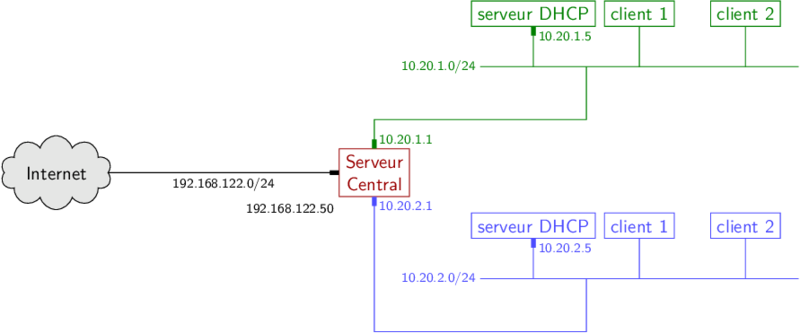

# Présentation & installation
## Outils de supervision de réseau de serveurs DHCP


*(Schéma de représentation de l'architecture type du réseau)*

---
Le produit a pour but de **simplifier l'administration** d'un réseau d'entreprise qui repose sur plusieurs serveurs dhcp.

Il est fournit un ensemble de **4 commandes** exécutables sur un serveur central qui permettent de manager à distance les différents serveurs dhcp.
Le principe est d'**améliorer la capacité d'évolutivité du réseau**.
Un fichier de configuration est prévu à cet effet, il est destiné à indiquer les serveurs dhcp qui devront être supervisés par le serveur central.

Les informations relatives aux options de configuration de la solution et d'utilisation des commandes sont répértoriées dans la documentation:  `configuration_et_usage.md`
## Installation du produit
### Actions à effectuer sur le serveur central
- installer ou mettre à jour le paquet pip

```bash
pip3 install fabric
pip install pyyaml
```
**Tout les fichiers du serveur central sont à mettre dans un même répertoire !**
*(toutes les commandes doivent être exécutées depuis ce même emplacement).*

- créer le fichier `config.yaml` avec la commande qui suit (le nom du fichier ne doit pas être modifié) :
```bash
python3 config.py create
```
- Modifier le fichier de configuration en respectant les indications données dans la documentation `configuration_et_usage.md`.

- Créer une clé ssh avec ou sans passphrase, à vous de choisir.
### Actions à faire pour ajouter un nouveau serveur dhcp
- Récupérer la clé rsa publique du serveur central sur le serveur dhcp.
- Importer sur le serveur dhcp le fichier d'initialisation `dhcp_init.sh`.
- modifier les premières lignes du fichier d'initialisation avant de l'exécuter.
```bash
#parameter that you need to set
user=""
rsa_pub_key_file=""
```
1. **user:** mettre le même utilisateur que celui dans `config.yaml`.
2. **rsa_pub_key_file:** mettre le chemin d'accès vers la clé publique du serveur central.

*(pas de soucis à se faire en cas d'oubli,le script est conçu pour ne pas agir sans que lesparamètres aient été changé)*.

- Exécuter le script.
